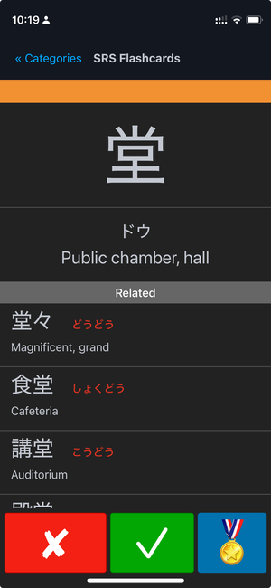
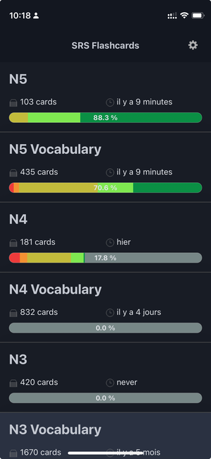

# SRS Flashcards

[](.ruby-version)
[](LICENSE.md)
[]()


---

## 🌟 Why SRS Flashcards?

> 🧠 **Science-Backed Learning**: Optimizes memory retention using spaced repetition algorithms proven by cognitive science research.

Master Japanese vocabulary and kanji efficiently with:

- 📈 **Adaptive Algorithm**: Automatically adjusts to your memory patterns
- 🗂 **Structured Content**: Organized by JLPT levels (N5-N1) and school grades
- 📱 **Seamless Experience**: PWA support for all devices
- ✈️ **Fully Offline**: Study anytime, anywhere - perfect for last-minute review during your trip to Japan!

---

## ✨ Key Features

### 🔍 Core Learning System
- 🧩 **Smart SRS**: Color-coded mastery tracking (gray→green)
- 📊 **JLPT Focus**: N5 to N1 vocabulary/kanji sets
- 🎯 **Visual Progress**: Clear indicators per category

### 🛠 Study Tools
- 🖥 **Clean Interface**: Distraction-free practice
- 🔗 **Context Links**: Related cards for deeper learning
- ⚙️ **Custom Sessions**: Tailor study parameters

### 📈 Progress Tracking
- 📅 **Daily Goals**: Points system with targets
- 📉 **Long-Term Stats**: Retention metrics over time (coming soon)  
- 🏆 **Achievements**: Milestone recognition (planned)

### 🌐 Cross-Platform
- 📲 **PWA Installable**: Works offline after setup
- 🔄 **Data Management**:
  - ⬇️ **Manual Export**: Download your progress anytime
  - ⬆️ **Manual Import**: Restore from saved files  
  - ⌛ **Auto-Sync**: Cloud synchronization (future update)
- 🖥️📱 **Responsive**: Optimized for all screens

---

## 🗃 Data Structure
For detailed schema: [🏗️ Data Schema Overview](docs/SCHEMA.md)

Key components:
- 🗂 **Cards**: Vocabulary/Kanji with SRS tracking
- 📁 **Categories**: JLPT/school groups
- ⏱ **Sessions**: Timed practice analytics

---

## 🚀 Getting Started

```bash
bin/setup  # Installs dependencies + DB setup
bin/server # Start development server
```
> 💡 Accept the self-signed certificate at `https://localhost:8000`

---

## 📚 Documentation

- [📊 SRS Algorithm Explained](docs/SRS_ALGORITHM.md)
- [🚀 Deployment Instructions](docs/DEPLOYMENT.md)
- [🗺️ Project Roadmap](docs/ROADMAP.md)
- [🏗️ Data Schema Overview](docs/SCHEMA.md)

## 📸 Screenshots

| Study Interface | Progress Dashboard |
|-----------------|--------------------|
|  |  |

## 💝 Support This Project

Love using SRS Flashcards? Help keep it ad-free and sustainable:

[](https://buymeacoffee.com/ybart)
[](https://github.com/sponsors/ybart)

